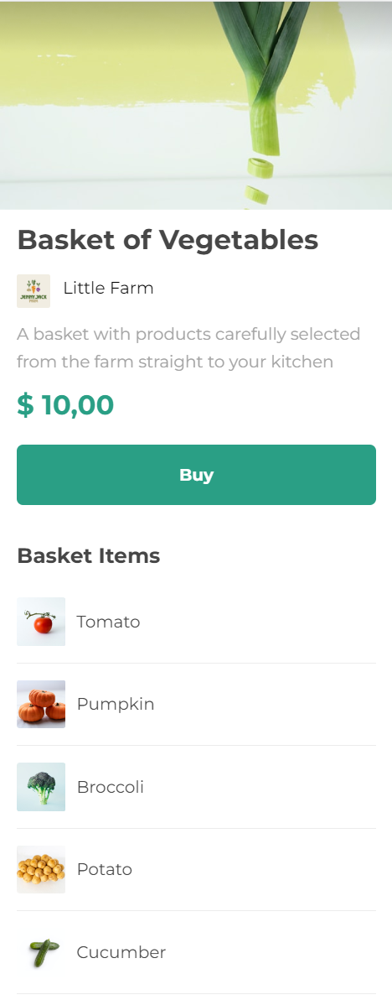

## Application building using react-native

Frontend application using Expo to create the project in React-Native.

### Commands to run the application locally:
#

`npm install`  : to install the dependencies;

`npm start`   : to run the application;

### Images of the application:
#

Top: 

